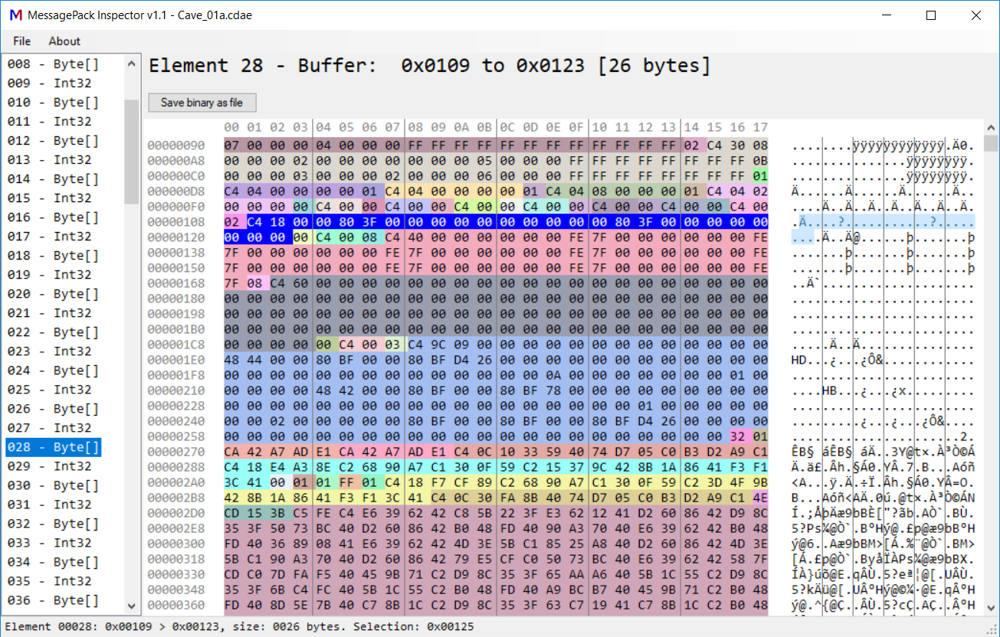

# MessagePack Inspector

Small C# utility that lets you inspect binary files that were written with [MessagePack](https://msgpack.org). Nearly dependency free, small codebase and easy to customize.

# Downloads

 * Windows: [MsgPackInspector-1.1.zip](https://github.com/BeamNG/msgpackInspector/releases/download/1.1/MsgPackInspector-1.1.zip)
 * [All releases](https://github.com/BeamNG/msgpackInspector/releases/)

# Libraries / Acknowledgements
 * Developed with .net framework 4.6.1
 * Customized [Be.HexEditor](https://sourceforge.net/projects/hexbox/) - HexEdit Control. MIT license
 * [msgpack-cli](https://github.com/msgpack/msgpack-cli) - C# msgpack library. Apache License 2.0

# How to build
Simply open `msgpackinspector.sln` in Visual Studio and build the solution.
